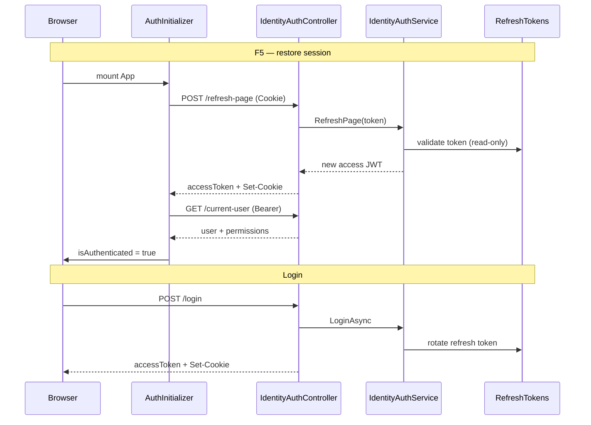

# Identity — Login, Refresh Token & F5 Session

Tài liệu mô tả luồng xác thực FE ↔ BE: access token trong Redux, refresh token trong HttpOnly cookie, restore session khi F5.

## Tổng quan token

| Token | Lưu ở đâu | Mục đích |
|-------|-----------|----------|
| **Access token** (JWT) | Redux `userSlice` (memory) | Bearer header cho mọi API `[Authorize]` |
| **Refresh token** | HttpOnly cookie `refreshToken` | Chỉ dùng cho `POST /api/identity/auth/refresh-page` |

- **Không** lưu access/refresh token vào `localStorage`.
- Cookie do BE set khi login / refresh-page; FE gọi API với `withCredentials: true` (axios).

---

## Luồng Login

```
FE Login.tsx
  → POST /api/identity/auth/login { email, password }
  ← accessToken (body) + Set-Cookie: refreshToken (HttpOnly)
  → dispatch setAccessToken(accessToken)
  → GET /api/identity/auth/current-user (Bearer)
  → dispatch setUser + finishHydration → vào app
```

**BE `LoginAsync`:** validate user → tạo JWT + refresh token → lưu hoặc cập nhật 1 row `RefreshTokens` theo user → `SaveChanges` → **rotate refresh token**.

**File FE:** `Frontend/prism-erp-web/src/components/Login.tsx`

---

## Luồng F5 (restore session)

```
main.tsx → StoreProvider → App → AuthInitializer
  → hydrateSessionOnce()   [dedupe — 1 promise cho React StrictMode]
  → POST /api/identity/auth/refresh-page   (browser tự gửi cookie)
  ← accessToken (body) + Set-Cookie (renew expiry)
  → dispatch setAccessToken
  → GET /api/identity/auth/current-user
  → dispatch setUser + finishHydration → vào app
```

Không có cookie hoặc token invalid → `clearAuth()` → màn Login.

**File FE:** `Frontend/prism-erp-web/src/components/AuthInitializer.tsx`

---

## BE `refresh-page`

| | |
|---|---|
| **Route** | `POST /api/identity/auth/refresh-page` |
| **Auth** | `[AllowAnonymous]` — đọc cookie thủ công trong action |
| **Controller** | `Backend/src/Api/PrismERP.Api/Controllers/IdentityAuthController.cs` |
| **Service** | `IdentityAuthService.RefreshPage` |

### Xử lý

1. Đọc cookie `refreshToken`.
2. Tìm row trong DB, check `IsActive()`, user còn active.
3. Tạo **access token JWT mới**.
4. **Không rotate** chuỗi refresh token khi F5 (chỉ cấp access token mới) — tránh `DbUpdateConcurrencyException` khi FE gọi trùng (React StrictMode).
5. Refresh token vẫn **rotate khi login**.

### Response

```json
{
  "accessToken": "...",
  "accessTokenExpiresAt": "..."
}
```

Cookie `refreshToken` được set lại (cùng giá trị, renew `Expires`).

### Lưu ý kỹ thuật

- **Không** dùng `[Authorize(AuthenticationSchemes = "MyRefreshCookieScheme")]` — scheme đó expect ASP.NET auth ticket, trong khi login set cookie **plain token** qua `Response.Cookies.Append`.
- `MyRefreshCookieScheme` trong `Program.cs` vẫn tồn tại nhưng không dùng cho endpoint này.

---

## Cookie

| Thuộc tính | Development | Production |
|------------|-------------|------------|
| Name | `refreshToken` | `refreshToken` |
| HttpOnly | ✓ | ✓ |
| Secure | `false` | `true` |
| SameSite | Lax | Lax |

**CORS:** policy `Frontend` — `AllowCredentials` + origins `http://localhost:5173`, `https://localhost:5173`, `http://localhost:3000`.

---

## Redux & apiClient (FE)

### `userSlice`

| Field | Ý nghĩa |
|-------|---------|
| `accessToken` | JWT hiện tại |
| `user` | `CurrentUserResponse` (userId, email, displayName, roles, permissions) |
| `isAuthenticated` | `true` sau `setUser` |
| `isHydrating` | `true` lúc khởi động → `false` sau hydrate/login thành công |

**File:** `Frontend/prism-erp-web/src/app/userSlice.ts`

### `apiClient`

- `withCredentials: true`
- Request interceptor: `Authorization: Bearer {accessToken}` từ Redux store
- Response 401 (trừ `/login`, `/refresh-page`) → `dispatch(clearAuth())`

**File:** `Frontend/prism-erp-web/src/services/apiClient.ts`

### Dedupe hydrate (StrictMode)

`hydrateSessionPromise` ở **module scope** — nhiều lần mount trong dev chỉ gọi **một** chuỗi `refresh-page` + `current-user`.

---

## Middleware permissions

Sau JWT validate, `PermissionsEnrichmentMiddleware` load permissions theo `userId` (dùng `RequestAborted`).

`GET /api/identity/auth/current-user` trả user info kèm permissions đã enrich.

**File:** `Backend/src/Modules/Identity/PrismERP.Modules.Identity.Infrastructure/Auth/PermissionsEnrichmentMiddleware.cs`

---

## API endpoints (auth)

| Method | Path | Auth |
|--------|------|------|
| POST | `/api/identity/auth/login` | Anonymous |
| POST | `/api/identity/auth/refresh-page` | Cookie `refreshToken` |
| GET | `/api/identity/auth/current-user` | Bearer JWT |
| POST | `/api/identity/auth/logout` | Bearer JWT |
| POST | `/api/identity/auth/change-password` | Bearer JWT |

---

## Logout

FE gọi `POST /api/identity/auth/logout` rồi `clearAuth()`.

BE `LogoutAsync` cần `refreshToken` trong body; token thực tế nằm trong HttpOnly cookie — **logout server-side revoke có thể fail** nếu body rỗng. Client vẫn clear session UI.

---

## Sự cố đã xử lý

| Vấn đề | Nguyên nhân | Cách xử lý |
|--------|-------------|------------|
| `refresh-page` 401 | `MyRefreshCookieScheme` không khớp plain cookie | `[AllowAnonymous]` + đọc cookie trong action |
| `DbUpdateConcurrencyException` lần 2 | 2 request rotate cùng row `RefreshTokens` | FE `hydrateSessionOnce`; BE F5 không rotate refresh token |
| `TaskCanceledException` thỉnh thoảng | Browser cancel request khi F5/HMR | Bình thường khi client disconnect; có thể bỏ qua ở handler |

---

## Sơ đồ tổng thể



---

## Gap / TODO

- [ ] Logout đọc refresh token từ cookie (không bắt buộc body từ FE)
- [ ] `GlobalExceptionHandler`: map `OperationCanceledException` — không log Error
- [ ] FE `AuthInitializer`: bỏ qua axios cancel trong `.catch`
- [ ] Rotate refresh token định kỳ (policy riêng, không phải mỗi F5)
