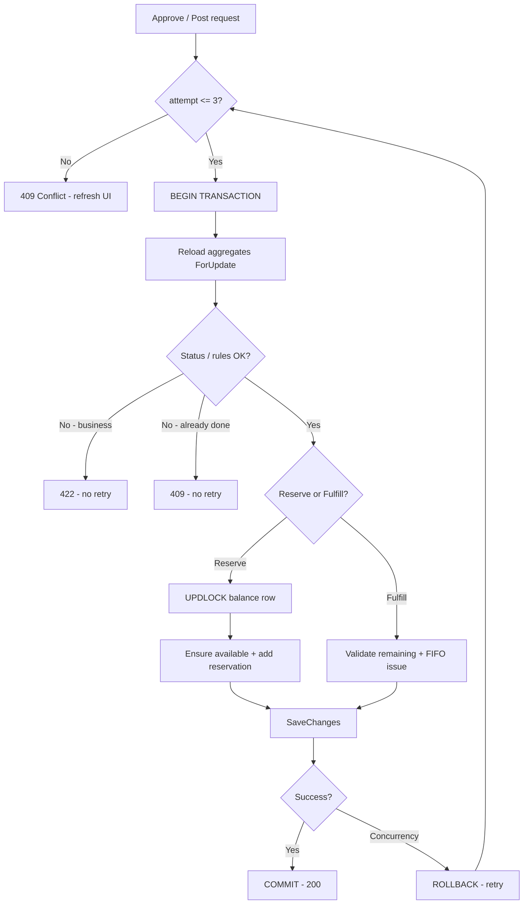

# Inventory Concurrency — Vấn đề, hướng xử lý & trade-off

Tài liệu phân tích race condition và optimistic concurrency khi **Sales Approve (Reserve)** và **Delivery Post (Fulfill / xuất kho)** tương tác với Inventory. Bám sát implementation hiện tại trong repo.

**Liên quan:** [INVENTORY.md](INVENTORY.md) (luồng nghiệp vụ), `SalesOrderService.ApproveAsync`, `DeliveryNoteService.PostAsync`, `InventorySalesReservationWorkflowService`.

---

## 1. Cơ chế hiện tại

### 1.1 Luồng và transaction

| Thao tác | Transaction | SaveChanges | Inventory |
|----------|-------------|-------------|-----------|
| **SO Approve** | `ExecuteInTransactionAsync` (Sales) | 1 lần cuối | `ReserveForSalesOrderAsync` — INSERT reservation |
| **DN Post** | `ExecuteInTransactionAsync` (Sales) | 1 lần cuối | `FulfillReservationsAsync` — UPDATE reservation, balance, layers, movements |
| **DN Cancel (Posted)** | Có | 1 lần | `ReturnDeliveryIssuesAsync` — reverse fulfill |

Workflow inventory **không** gọi `SaveChanges` — caller (Sales module) save một lần trong transaction.

### 1.2 Optimistic concurrency

- Mọi aggregate có **`RowVersion`** (SQL Server `rowversion`).
- `Get*ForUpdateAsync` = EF **tracking**, **không** phải `SELECT ... WITH (UPDLOCK)`.
- Transaction isolation: **READ COMMITTED** (SQL Server default).
- **Không** có retry policy trên `DbUpdateConcurrencyException`.
- `GlobalExceptionHandler`: concurrency → **500** (chưa map 409).

### 1.3 Check tồn khi Reserve

`InventoryAvailabilityChecker.EnsureAvailableAsync`:

- Load balance **`AsNoTracking`**.
- `SUM(Active reservation RemainingQuantity)` từ DB.
- `available = QuantityOnHand - reserved` → `BusinessException` nếu thiếu.

Snapshot tại thời điểm gọi — **không** giữ lock đến lúc commit.

### 1.4 Validate DN Post (điểm yếu)

`DeliveryNoteService.PostAsync` load reservations và validate `QuantityDelivered vs RemainingQuantity` **ngoài** transaction, rồi truyền entity reservation vào `FulfillReservationsAsync` trong transaction → **stale read** khi 2 DN partial cùng SO line.

### 1.5 Approve / Post load aggregate

`SalesOrder`, `DeliveryNote` thường load **`GetByIdWithLinesForUpdateAsync` trước** khi vào `ExecuteInTransactionAsync` → hai user cùng thấy `Draft` → double Approve/Post có thể xảy ra trước khi RowVersion bảo vệ.

---

## 2. Tài nguyên tranh chấp (contention)

```
                         ┌──────────────────────┐
    SO Approve ─────────►│  InventoryBalance   │◄──────── DN Post (FIFO)
    (reserve)            │  (Product × WH)     │         (issue)
                         └──────────┬───────────┘
                                    │
              ┌─────────────────────┼─────────────────────┐
              ▼                     ▼                     ▼
     InventoryReservation    InventoryCostLayer      InventoryMovement
     (1 Active / SO line)     (FIFO consume)
```

| Entity | Approve (Reserve) | Post (Fulfill) |
|--------|-------------------|----------------|
| `InventoryBalance` | Đọc (check available), **thường không UPDATE** | **UPDATE** `QuantityOnHand` |
| `InventoryReservation` | **INSERT** | **UPDATE** fulfillment |
| `InventoryCostLayer` | — | **UPDATE** consume |
| `SalesOrder` / `DeliveryNote` | UPDATE status | UPDATE status + invoice |

**Reserve** chủ yếu thêm row mới → **ít** khi đụng RowVersion balance.  
**Fulfill** sửa nhiều row → **dễ** `DbUpdateConcurrencyException`.

---

## 3. Các problem cụ thể

### P1 — Hai user Approve **cùng một SO**

| | |
|---|---|
| **Mô tả** | Cả hai load SO `Draft`, cùng vào transaction reserve + approve. |
| **Hậu quả** | Trùng reservation (nếu line chưa unique); hoặc `DbUpdateConcurrencyException` trên `SalesOrder`; hoặc SO Confirmed 2 lần logic. |
| **Loại lỗi mong muốn** | **409 Conflict** — "SO đã confirmed, refresh". |
| **Hiện tại** | Có thể **500** (RowVersion) hoặc *"active reservation already exists"* (422). |

---

### P2 — Hai **SO khác nhau**, cùng Product×Warehouse, Approve đồng thời (oversell)

| | |
|---|---|
| **Mô tả** | On-hand 100; SO-A reserve 60, SO-B reserve 60; cả hai pass `EnsureAvailable` (đọc reserved=0). |
| **Hậu quả** | Tổng reserve 120 > 100 — **oversell ở soft lock**, on-hand vẫn 100. Lỗi có thể **không lộ** tại Approve. |
| **Vì sao retry không cứu** | Balance **RowVersion không đổi** (chỉ INSERT reservation). Cả hai **commit thành công**, không exception. |
| **Lộ lỗi muộn** | DN Post / FIFO issue / thiếu layer. |

Đây là **problem nghiêm trọng nhất** ở tầng Reserve.

---

### P3 — Một SO, **nhiều line cùng SKU**, Approve một lần

| | |
|---|---|
| **Mô tả** | Line 1 add reservation 10 (chưa SaveChanges); Line 2 gọi `EnsureAvailable` SUM từ DB — **chưa thấy** line 1 pending. |
| **Hậu quả** | Over-reserve **trong cùng SO** (edge case). |
| **Ghi chú** | Cần tính available gồm reservation **pending trong ChangeTracker** hoặc running total in-memory trong TX. |

---

### P4 — Hai user Post **cùng một DN** (double-click / 2 tab)

| | |
|---|---|
| **Mô tả** | Cả hai load DN `Draft`, fulfill + invoice + Posted. |
| **Hậu quả** | Double issue, double invoice; hoặc RowVersion conflict. |
| **Loại lỗi mong muốn** | **409** — "DN đã posted". |
| **Retry** | Có ích nếu reload DN trong TX thấy `Posted`. |

---

### P5 — Hai **DN khác nhau**, cùng SO line, partial delivery đồng thời

| | |
|---|---|
| **Mô tả** | Remaining=10; DN1 giao 6, DN2 giao 6; validate **ngoài TX** với `RemainingQuantity` cũ — cả hai pass. |
| **Hậu quả** | Over-fulfill; `RecordFulfillment` / RowVersion / thiếu tồn. |
| **Retry** | **Có ích** nếu reload reservation **trong TX** trước fulfill. |

---

### P6 — DN Post + Approve / Issue / Adjust / DN khác cùng balance

| | |
|---|---|
| **Mô tả** | Tran chấp trên cùng `InventoryBalance` / cost layers. |
| **Hậu quả** | `DbUpdateConcurrencyException` tại SaveChanges. |
| **Retry + reload** | **Phù hợp** (optimistic). |

---

### P7 — Gap nghiệp vụ làm concurrency tệ hơn

- SO **Cancel** chưa release reservation (Confirmed không cancel được theo domain hiện tại).
- **`warehouseId = 1` hardcode** — mọi SO tranh một kho logic.
- Không map **409** / không **retry** → UX 500, user retry mù.

---

## 4. Ma trận: problem → triệu chứng → xử lý

| ID | Kịch bản | Exception thường gặp | Retry 3 lần? | Cần thêm |
|----|----------|----------------------|--------------|----------|
| P1 | 2× Approve cùng SO | RowVersion / duplicate reservation | Một phần | Reload SO trong TX; unique SO line |
| P2 | 2× Approve cross-SO cùng SKU | **Không exception** | **Không đủ** | Row lock balance hoặc chặn muộn lúc Post |
| P3 | 1 SO nhiều line cùng SKU | Business / oversell | Không | Pending reservation trong TX |
| P4 | 2× Post cùng DN | RowVersion | Có | Reload DN trong TX |
| P5 | 2× DN cùng SO line | RowVersion / Business | Có | Reload reservation trong TX |
| P6 | Fulfill + thao tác khác | RowVersion | Có | Reload balance/layers |
| P7 | Policy / UX | 500 | — | 409 mapping, FE refresh |

**Quy tắc retry:**

- **Retry:** chỉ `DbUpdateConcurrencyException` (và tương đương), max 3, reload đầu mỗi attempt.
- **Không retry:** `BusinessException` (422), status conflict sau reload (409).

---

## 5. Hướng xử lý & trade-off chi tiết

### 5.1 Reload + validate trong transaction

**Mô tả:** Mở transaction → reload SO/DN/reservation ForUpdate → validate status & qty → mutate → SaveChanges.

| Ưu | Nhược |
|-----|--------|
| Bỏ stale read (P4, P5) | Refactor Post/Approve |
| Double Approve/Post giảm mạnh | Transaction dài hơn chút |
| Khớp pattern unit-of-work hiện tại | |

**Áp dụng:** Approve, Post (bắt buộc nên làm).

---

### 5.2 `ExecuteInTransactionWithRetryAsync` (max 3)

**Mô tả:** Wrapper: on `DbUpdateConcurrencyException` → rollback → reload → retry.

| Ưu | Nhược |
|-----|--------|
| Xử lý P4–P6 tốt | **Không** fix P2 (oversell không exception) |
| Ít thay schema | Cần map 409 khi hết retry |
| Chuẩn optimistic concurrency | Retry mù nếu không reload đúng entity |

**Áp dụng:** Approve, Post, có thể Purchasing GR Post tương tự.

**Không áp dụng cho:** `EnsureAvailable` riêng lẻ — retry ở caller.

---

### 5.3 HTTP 409 vs 422

| Code | Khi nào | Retry client? |
|------|---------|---------------|
| **422** | Thiếu tồn, qty > remaining, business rule | Không — sửa qty / báo user |
| **409** | RowVersion hết retry; document đã đổi trạng thái | Có — refresh list rồi thử lại |

| Ưu | Nhược |
|-----|--------|
| FE phân biệt "refresh" vs "sai nghiệp vụ" | Cần sửa `GlobalExceptionHandler` + FE |

---

### 5.4 Unique index — reservation active theo SO line

```sql
-- Ý tưởng: unique (ReferenceType, ReferenceId) WHERE Status = Active
```

| Ưu | Nhược |
|-----|--------|
| Chặn P1 / double reserve **cùng line** ở tầng DB | **Không** chặn P2 (2 SO khác nhau) |
| Rẻ, rõ ràng | Cần migration + handle duplicate key → 409/422 |

**Kết luận:** **Nên có** — necessary, not sufficient.

---

### 5.5 Row lock balance (`UPDLOCK`) khi Reserve

**Mô tả:** Trong Approve TX, khi reserve line: `SELECT balance WITH (UPDLOCK, ROWLOCK)` — khóa **một row** Product×WH, không lock table.

| Ưu | Nhược |
|-----|--------|
| Fix P2 — SO thứ 2 chờ SO thứ 1 commit rồi re-check available | Approve cùng SKU **xếp hàng** (chờ vài ms–s) |
| Không oversell soft lock | Implementation (raw SQL / hint / proc) |
| Nhiều SO line cùng balance **OK** — cùng TX lock 1 lần, tuần tự các line | Hot SKU peak → queue tại Approve |

**Không phải:** lock table, lock suốt đời SO (lock chỉ trong TX Approve).

| So với "lock table" | |
|---------------------|---|
| Lock table | Không dùng — block toàn bộ sản phẩm/kho |
| **Row lock balance** | Chỉ serialize Approve **cùng SKU + cùng kho** |

**Kết luận:** **Khuyến nghị** nếu muốn chặn oversell sớm (ERP thông thường).

---

### 5.6 Không lock — chỉ chặt lúc Post (fail late)

**Mô tả:** Cho phép over-reserve; DN Post / fulfill mới báo thiếu.

| Ưu | Nhược |
|-----|--------|
| Approve nhanh, không chờ lock | User "Approve OK" nhưng giao hàng fail |
| Retry Post vẫn hữu ích | Ops / CS phải xử lý SO đã confirm không giao được |
| Ít code lock | Uy tín nghiệp vụ kém hơn |

**Kết luận:** Chấp nhận được cho MVP / nội bộ thấp contention; **không** khuyến nghị production đa user cùng SKU.

---

### 5.7 `SaveChanges` giữa chừng trong Ensure / Reserve

**Mô tả:** Save sau mỗi line reserve để "ai nhanh thắng".

| Ưu | Nhược |
|-----|--------|
| — | Phá atomic Approve (reserve OK, Approve fail → reservation mồ côi) |
| | Vi phạm quy ước workflow không SaveChanges |
| | Vẫn race P2 nếu 2 TX song song trước save |

**Kết luận:** **Không nên.**

---

### 5.8 Serializable / lock table isolation

| Ưu | Nhược |
|-----|--------|
| Mạnh về lý thuyết | Deadlock, throughput thấp |
| | Overkill cho ERP module này |

**Kết luận:** Không khuyến nghị; dùng **UPDLOCK row** + retry đủ.

---

### 5.9 Denormalized `ReservedQty` trên Balance + Touch()

**Mô tả:** Mỗi reserve UPDATE balance reserved column → RowVersion đổi → retry có tác dụng cho P2.

| Ưu | Nhược |
|-----|--------|
| Retry-only có thể đủ cross-SO | Schema change, sync logic |
| | Duplicate source of truth với SUM reservation |

**Kết luận:** Alternative nếu không muốn UPDLOCK; **UPDLOCK đơn giản hơn** với schema hiện tại.

---

## 6. Reserve vs Fulfill — retry có đủ không?

| | **Reserve (Approve)** | **Fulfill (DN Post)** |
|---|------------------------|------------------------|
| Thao tác DB | INSERT reservation | UPDATE reservation, balance, layers |
| Balance RowVersion | Thường **không đổi** | **Đổi** |
| 2 TX song song | Có thể **cùng commit** (P2) | Một thường fail RowVersion |
| Retry + reload đủ? | **Không** (thiếu exception) | **Gần đủ** + validate trong TX |
| Cần thêm | Unique SO line + **UPDLOCK balance** | Reload reservation trong TX |

**Tóm lại:** Không áp một rule "retry hết" — **Fulfill** hợp optimistic retry; **Reserve cross-SO** cần **lock hoặc tương đương**.

---

## 7. Pattern đề xuất (implementation target)

```
for attempt = 1 .. 3:
  try:
    BEGIN TRANSACTION
      reload SO | DN | reservations (ForUpdate)
      if status invalid → throw ConflictException (409, no retry)
      if Reserve:
        for each line:
          UPDLOCK balance (product × wh)
          ensure available (DB sum + pending in TX)
          add reservation
        approve SO
      if Post:
        validate remaining per line (fresh)
        fulfill → post DN → invoice
      SaveChanges
    COMMIT
    return success
  catch DbUpdateConcurrencyException when attempt < 3:
    ROLLBACK; continue
  catch BusinessException:
    ROLLBACK; return 422
  catch ConflictException:
    ROLLBACK; return 409
throw ConflictException("Data changed, please refresh")
```

---

## 8. Khuyến nghị theo tier

### Tier 1 — Minimum (nên làm trước)

1. `ExecuteInTransactionWithRetryAsync` (max 3) trên Approve / Post.
2. Reload + validate **trong** transaction (SO, DN, reservation).
3. Post: bỏ validate reservation **ngoài** TX; dùng `GetByReferencesForUpdateAsync` trong TX.
4. Map `DbUpdateConcurrencyException` → **409**; `BusinessException` → **422**.
5. **Unique index** reservation active `(ReferenceType, ReferenceId)`.
6. FE: 409 → toast + refresh list; disable nút khi submitting.

**Fix:** P1, P4, P5 (phần lớn), P6, P7 (UX). **Chưa fix:** P2.

### Tier 2 — Production multi-user cùng SKU

7. **UPDLOCK** (row) balance khi Reserve trong Approve.
8. Ensure available tính **pending reservations** trong cùng TX (P3).

**Fix:** P2, P3.

### Tier 3 — Tùy chọn

9. SO Cancel Confirmed → release reservation.
10. Warehouse từ SO thay hardcode.
11. `OperationCanceledException` → không log Error (client disconnect).

---

## 9. Sơ đồ quyết định



---

## 10. File code liên quan

| File | Vai trò |
|------|---------|
| `SalesOrderService.cs` | Approve + transaction |
| `DeliveryNoteService.cs` | Post — validate reservation ngoài TX |
| `InventorySalesReservationWorkflowService.cs` | Reserve / Fulfill |
| `InventoryAvailabilityChecker.cs` | EnsureAvailable no-tracking |
| `InventoryBalanceRepository.cs` | ForUpdate = tracking only |
| `SalesOrderingUnitOfWork.cs` | Transaction, chưa retry |
| `GlobalExceptionHandler.cs` | Chưa 409 / OperationCanceled |

---

## 11. Gap / TODO (tracking)

- [ ] `ExecuteInTransactionWithRetryAsync` + 409 mapping
- [ ] Approve/Post: reload trong TX
- [ ] Post: reservation ForUpdate trong TX
- [ ] Unique index reservation active per reference
- [ ] UPDLOCK balance on Reserve (Tier 2)
- [ ] Pending reservation trong Ensure (multi-line same SKU)
- [ ] SO Cancel release reservation
- [ ] FE handle 409 / 422
